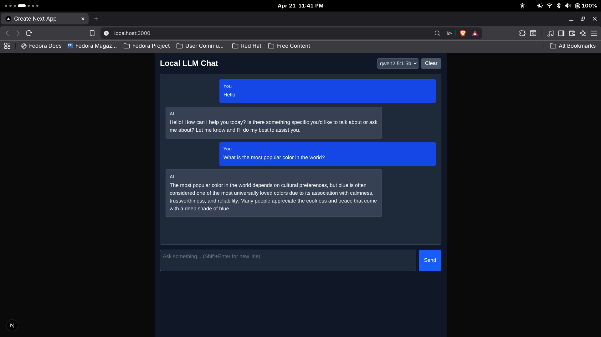

# Local LLM Chat

### FastAPI • Next.js • Ollama

A minimal, fully local LLM chat system designed for low-latency interaction with Ollama models. This project focuses on real-time streaming, full-context conversation handling, and complete developer control — with zero reliance on external APIs.

It is built to explore **practical local AI workflows**, emphasizing transparency, simplicity, and performance over abstraction-heavy frameworks.

---

## Demo

### Video Walkthrough

[](https://www.youtube.com/watch?v=8Sp6opsaVtw)

### Screenshots



---

## Key Capabilities

- Token-streamed responses from local LLMs
- Full multi-turn conversation support via message replay
- Dynamic model discovery from Ollama runtime
- Interruptible generation (user-controlled cancellation)
- Persistent chat history (client-side)
- Markdown-rendered assistant responses
- Clean, minimal UI optimized for interaction speed

---

## System Architecture

```
User → Next.js Frontend → FastAPI Backend → Ollama Runtime → Model
```

### Design Decisions

- **Full-context replay**  
  Instead of summarizing memory, the system sends the entire message history per request. This prioritizes response fidelity over token efficiency.

- **Client-side persistence**  
  Chat state is stored in `localStorage` to avoid backend session complexity and keep the system stateless.

- **Streaming over HTTP**  
  Incremental response streaming is implemented to simulate token-level output without introducing WebSocket overhead.

- **Loose coupling with model runtime**  
  Backend acts as a thin proxy, making it easy to swap or extend model providers beyond Ollama.

---

## Tech Stack

| Layer         | Technology                 |
| ------------- | -------------------------- |
| Frontend      | Next.js, React, TypeScript |
| Backend       | FastAPI, Python            |
| Model Runtime | Ollama                     |
| Styling       | Tailwind CSS               |
| Rendering     | React Markdown             |

---

## Project Structure

```bash
local-chat/
├── backend/
│   ├── main.py
│   └── requirements.txt
└── frontend/
    ├── package.json
    └── src/
        └── app/
            └── page.tsx
```

---

## API

### `GET /models`

Returns available local models.

```json
{
  "models": ["qwen2.5:1.5b", "llama3.2:1b"]
}
```

---

### `POST /chat`

Streams a response using full conversation context.

```json
{
  "messages": [
    { "role": "user", "content": "Hello" },
    { "role": "assistant", "content": "Hi, how can I help?" },
    { "role": "user", "content": "Explain recursion simply." }
  ],
  "model": "qwen2.5:1.5b"
}
```

---

## Local Setup

### 1. Clone

```bash
git clone https://github.com/Uthso66/local-chat.git
cd local-chat
```

---

### 2. Start Ollama

Ensure Ollama is installed and running:

```bash
ollama pull qwen2.5:1.5b
ollama serve
```

Default endpoint:

```
http://localhost:11434
```

---

### 3. Backend

```bash
cd backend
pip install -r requirements.txt
python main.py
```

Runs on:

```
http://localhost:8000
```

---

### 4. Frontend

```bash
cd frontend
npm install
npm run dev
```

Runs on:

```
http://localhost:3000
```

---

## Configuration

| Component   | Default                |
| ----------- | ---------------------- |
| Backend API | http://localhost:8000  |
| Ollama API  | http://localhost:11434 |

Modify endpoints directly in source if needed.

---

## Limitations

- No server-side persistence (by design)
- Full-context replay can become inefficient for very long conversations
- No authentication or multi-user support
- Optimized for local development, not production deployment

---

## Roadmap

- Token streaming optimization (latency reduction)
- Optional server-side session storage
- Model parameter controls (temperature, top_p, etc.)
- WebSocket-based streaming pipeline
- Multi-model comparison interface
- Dockerized setup for reproducible environments

---

## Author

Uthso  
Software QA Engineer • Security Enthusiast • AI/ML Practitioner

- GitHub: https://github.com/Uthso66
- LinkedIn: https://www.linkedin.com/in/tarikul-islam-uthso/

---

## License

MIT License © 2025 Uthso
